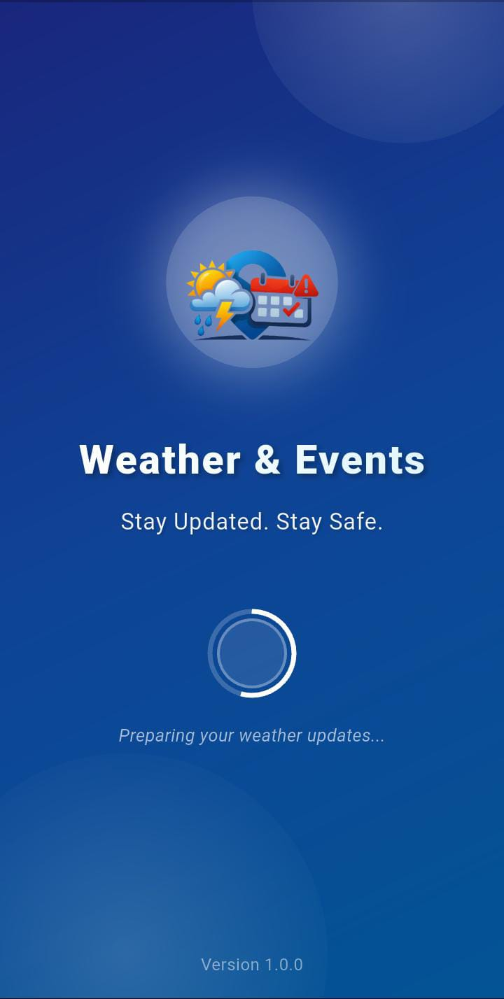

# Ayesha Ali — Portfolio Website

A personal portfolio website for **Ayesha Ali**, a Computer Science graduate, Flutter developer, and graphic designer. The site showcases technical projects, design work, skills, education, and contact information in a single responsive page.

🔗 **Live Site:** https://ayeshaali-coder.github.io/portfolio/

---

## ✨ Features

- **Responsive single-page design** — works smoothly on desktop, tablet, and mobile
- **Animated hero section** with a typing effect that cycles through roles (Flutter Developer, Graphic Designer, etc.)
- **About section** with bio, tags, and personal info cards
- **Skills section** organized by category (Mobile Development, Backend & Cloud, Graphic Design, Programming, UI/UX, Tools)
- **Experience timeline**
- **Final Year Project showcase** — dedicated section for the *Weather & Events Alert App* with feature list, tech stack, and a clickable screenshot gallery (with lightbox + prev/next navigation)
- **Design portfolio gallery** — filterable by category (Logos, Branding, Social Media, UI Mockups, Other) with a click-to-enlarge lightbox
- **Education section**
- **Contact section** with a simple contact form (front-end only, no backend submission yet)
- **Smooth scroll navigation** with active-link highlighting and a mobile hamburger menu
- **Scroll-triggered fade-in animations**

---

## 🛠️ Built With

- **HTML5** & **CSS3** (custom properties / CSS variables for theming)
- **Vanilla JavaScript** (no frameworks) — handles navigation, lightboxes, filtering, typing animation, and form interaction
- **[Font Awesome](https://fontawesome.com/)** — icons
- **[Google Fonts](https://fonts.google.com/)** — Playfair Display, Inter, DM Mono

---

## 📁 Project Structure

```
.
├── index.html
├── README.md
└── images/
    ├── avatar/
    │   └── profile.jpg
    ├── fyp/
    │   ├── SplashScreen.jpeg
    │   ├── welcome_screen.png
    │   ├── signup_screen.png
    └── design/
        └── profile.jpg   # replace with real design portfolio images
```

> **Note:** Some design portfolio images currently use [placehold.co](https://placehold.co) placeholder URLs. Replace these with real image files in `images/design/` before publishing.

---

## 🚀 Getting Started

### View locally
1. Clone the repository:
   ```bash
   git clone https://github.com/AyeshaAli-coder/portfolio.git
   ```
2. Open `index.html` directly in your browser, or serve it with a simple local server:
   ```bash
   python -m http.server 8000
   ```
3. Visit `http://localhost:8000` in your browser.

### Deploy with GitHub Pages
1. Push your code (including the `images/` folder) to GitHub.
2. Go to your repo → **Settings → Pages**.
3. Under **Source**, select the branch (e.g. `main`) and root folder (`/`).
4. Save — your site will be live at `https://<your-username>.github.io/<repo-name>/` within a minute or two.

---

## 🖼️ Adding / Replacing Images

Image paths in `index.html` are relative, e.g.:

```html

```

To add or replace an image:
1. Upload the file to the matching folder in `images/` (via GitHub web UI: **Add file → Upload files**, or `git add` + `git push`).
2. Make sure the **file name and extension match exactly** (case-sensitive) what's referenced in `index.html`.
3. Commit your changes — GitHub Pages will rebuild automatically.

---

## ✏️ Customization

- **Personal info:** update name, email, location, and degree in the `#about` and `#contact` sections.
- **Skills/Tags:** edit the `<span class="tag">` and `<span class="stag">` elements.
- **Projects:** duplicate the `#fyp` section structure to add more projects.
- **Design gallery:** add new `<div class="gallery-item" data-cat="...">` blocks inside `#designGallery`, matching one of the existing filter categories (`logo`, `brand`, `social`, `ui`, `other`).
- **Colors/Theme:** adjust the CSS variables at the top of the `<style>` block (`--rose`, `--violet`, `--ink`, etc.) to change the color palette.

---

## 📬 Contact

- **Email:** 
- **Location:** District Dir Lower, Khyber Pakhtunkhwa, Pakistan

---

## 📄 License

This project is open for personal use and customization. Feel free to fork it and adapt it for your own portfolio.
